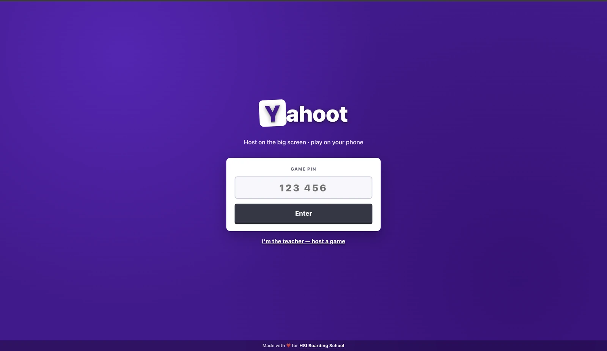

# Yahoot

A self-hosted, Kahoot-style live quiz for real classrooms. A teacher hosts on the
projector, students join from their phones with a PIN, answer timed questions,
and watch the leaderboard move between rounds.

Built to run a whole class on the cheapest VPS a school can rent: **one
container, one file, no database server, no Redis.**



## Why it is small

Every number below is measured, not estimated — see [Benchmarks](#benchmarks).

| | |
|---|---|
| First load for a student | **~107 KB** over the wire (app + font, Brotli) |
| Container image | **116 MB** |
| Memory, 80 players mid-game | **~80 MB** |
| Answer round-trip, 150 simulated players | **p95 3 ms** |
| Services to run | **1** — the container |
| Runtime dependencies | **4** (`jose`, `react`, `react-dom`, `zod`) |

Everything else is Bun's standard library: HTTP, WebSockets, SQLite, password
hashing, image processing and the bundler are all built in.

## Features

**For the teacher**

- Quiz editor with two question kinds: multiple choice (2–6 answers) and
  true/false
- Optional media per question: an image (uploaded or linked) or an embedded
  YouTube clip
- Per-quiz defaults — time limit, points, and a backdrop theme with live preview
- Import questions from CSV
- Host view for the projector: PIN, live answer count, reveal, leaderboard
- Per-session reports, exportable as CSV

**For students**

- Join with a PIN — no account, no install, no app store
- Nickname is optional; skip it and get a random one
- Pick an animal avatar
- Speed-weighted scoring, rank-change arrows (▲3 / ▼1), emoji reactions, podium

**For whoever runs it**

- One SQLite file holds accounts, quizzes, results **and** live game state —
  back it up by copying it
- A restart mid-game does not lose the session
- Migrations apply automatically on boot, idempotently
- Structured JSON logs, and a health check that actually queries the database

## Requirements

- [Bun](https://bun.com) **1.4 or newer** (the image pipeline uses `Bun.Image`)
- For deployment: Docker, and roughly 1 GB of RAM

## Quick start

```bash
git clone https://github.com/andynur/yahoot.git
cd yahoot
bun install

cp .env.example .env
# Set JWT_SECRET to something random:
#   openssl rand -hex 32

bun run db:migrate
bun run db:seed        # demo teacher: demo@example.com / demo1234
bun dev
```

Open <http://localhost:3001>. Sign in, press **Host**, and join from your device
at `http://<your-lan-ip>:3001` with the PIN on screen.

### With Docker

The image carries the backend plus a pre-built frontend, so it needs nothing but
a volume:

```bash
docker build -t yahoot .
docker run -d --name yahoot \
  -e JWT_SECRET="$(openssl rand -hex 32)" \
  -v yahoot-data:/data \
  -v yahoot-uploads:/app/apps/server/uploads \
  -p 3020:3020 \
  yahoot
```

Both volumes are required — without them a redeploy wipes every quiz and picture.
See [DEPLOY.md](DEPLOY.md) for Easypanel and other hosts.

## Configuration

| Variable | Default | Notes |
|---|---|---|
| `JWT_SECRET` | — | **Required.** Generate with `openssl rand -hex 32`; never reuse the development value. |
| `DATABASE_PATH` | `./data/yahoot.db` | Relative paths resolve from the repo root. In Docker, point it at a volume. |
| `PORT` / `SERVER_PORT` | `3020` | `PORT` is what most hosts inject and wins if set. |
| `WEB_PORT` | `3001` | Development front-end server only. |
| `WEB_ORIGIN` | `http://localhost:3001` | CORS fallback. LAN origins are reflected automatically. |
| `NODE_ENV` | `development` | `production` tightens CORS. |
| `AUTO_MIGRATE` | `1` | Set `0` to skip migrations on container boot. |

One build-time variable, read by `bun run build:web`:

| Variable | Default | Notes |
|---|---|---|
| `PUBLIC_URL` | — | Your public origin, e.g. `https://quiz.school.sch.id`. Rewrites the social-preview image to an absolute URL. Optional: the tags are root-relative otherwise, which nearly every scraper resolves correctly. |

## Commands

```bash
bun dev              # server + web, both watching
bun test             # unit tests
bunx tsc --noEmit    # type check
bun run db:migrate   # apply pending migrations
bun run db:seed      # demo teacher and quiz
bun run build:web    # production bundle into apps/web/dist
bun run check:web    # fail if that bundle is stale
bun run loadtest     # simulate a full class (CLIENTS=150 bun run loadtest)
bun run audit        # dependency vulnerability scan
```

## How it fits together

```
apps/server      one Bun.serve: REST + WebSocket + game engine + /uploads
  db/            SQLite connection, migrations, seed
  game/          pure state machine + the engine that drives it
  state/         live game state (the live_* tables)
  http/          routes, auth, uploads, image re-encoding, static serving
apps/web         React: teacher dashboard, host screen, player screen
packages/shared  the wire protocol (Zod schemas) + pure scoring
```

A few rules the code holds to, because the game breaks in subtle ways otherwise:

1. **The server owns time and score.** The client renders a cosmetic countdown
   from a server-supplied deadline; late answers are rejected server-side.
2. **Live state lives in SQLite, never in process memory** — a restart
   mid-question still closes it on time.
3. **Closing a question is claimed atomically.** A whole class answering in one
   burst would otherwise score the room once per answer.
4. **Every WebSocket message is defined once**, as a Zod schema in
   `packages/shared/protocol.ts`, imported by both sides.
5. **Zod never reaches the browser.** The client imports runtime values from
   `@shared/wire` and types with `import type`; the build fails if a value import
   drags Zod back in.

Video is YouTube-only by design: a self-hosted clip would stream from the same
box that is running the game, to every phone in the room at once. Uploaded
images are re-encoded on arrival (capped at 1600 px, WebP) so a 4 MB photo costs
a class ~250 KB instead of ~4 MB each.

## Benchmarks

`bun run loadtest` drives a real game over real WebSockets — it connects N
players, answers every question, and verifies each one was scored exactly once.

```
$ CLIENTS=150 bun run loadtest

  answer round-trip (ms)   n=600  p50=1  p95=3  max=27
  broadcast fan-out (ms)   p50=3  p95=9
  accepted=600  rejected=0  errors=0  dropped=0

  scoredOncePerQuestion=OK
  CLEAN — no dropped messages
```

Measured on a laptop against the container; a 1 GB VPS is the intended target.

## Scaling limits

Single replica only — Bun's WebSocket pub/sub is per-process, so two instances
cannot see each other's players. One process comfortably handles a class; a whole
school hosting simultaneous games would need a different fan-out design.

## Contributing

Issues and pull requests are welcome.

```bash
bun install
bun test && bunx tsc --noEmit
bunx prettier --write .
```

If you change anything under `apps/web/src`, rebuild and commit the bundle —
`bun run build:web` — because the container ships it. `bun run check:web` fails
if you forget.

## License

[MIT](LICENSE) © Andy Nur

Made with ❤️ for [HSI Boarding School](https://hsiboardingschool.sch.id/).
